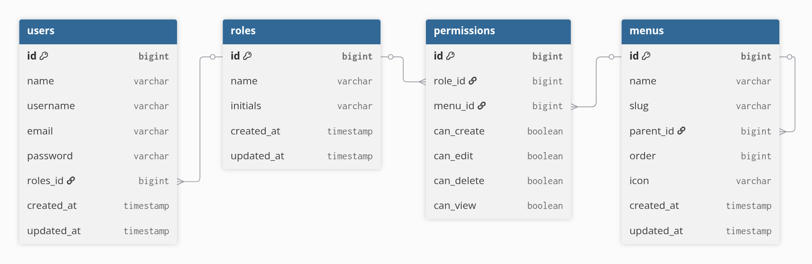

# Dashboard Kit — Laravel React Inertia

A dynamic RBAC (Role-Based Access Control) dashboard starter kit built with Laravel, Inertia.js, and React. Designed to be clean, modular, and ready to use — free for anyone to clone and build on top of.

> Built and maintained by [Wildan Ahmad Fahrezi](https://github.com/Wildan-AhmadF)

---

## Features

- **Dynamic RBAC** — Create roles and assign permissions per role
- **Menu Management** — Add menus dynamically; menus auto-appear in the permission page
- **User Management** — Create users and assign roles
- **Permission Control** — Per-menu permission with `can_view`, `can_create`, `can_edit`, `can_delete`
- **Parent-Child Menu Structure** — Supports nested menus (parent as label, child as permission target)
- **Flexible Database** — Supports SQLite (default) and MySQL via `.env`

---

## Installation

### Requirements

- PHP >= 8.2
- Composer
- Node.js >= 18
- NPM or Yarn

### Steps

```bash
# 1. Clone the repository
git clone https://github.com/Wildan-AhmadF/dashboard-kit.git
cd dashboard-kit

# 2. Install PHP dependencies
composer install

# 3. Install Node dependencies
npm install

# 4. Copy environment file
cp .env.example .env

# 5. Generate application key
php artisan key:generate

# 6. Run migrations & seeders
php artisan migrate --seed

# 7. Start development server
composer run dev
```

---

## Configuration

### SQLite (Default)

No additional setup needed. The `.env` is already configured to use SQLite out of the box.

```env
DB_CONNECTION=sqlite
# DB_DATABASE is auto-resolved to /database/database.sqlite
```

### MySQL

Update your `.env` file:

```env
DB_CONNECTION=mysql
DB_HOST=127.0.0.1
DB_PORT=3306
DB_DATABASE=your_database_name
DB_USERNAME=your_username
DB_PASSWORD=your_password
```

Then run:

```bash
php artisan migrate --seed
```

---

## Tech Stack

| Layer | Technology |
|---|---|
| Backend | Laravel 13 (new version) |
| Frontend | React 19 |
| Bridge | Inertia.js 3 |
| Styling | Tailwind CSS v4 |
| Database | SQLite / MySQL |

---

## ERD



> Table structure:
> - `users` — stores user accounts, linked to a role
> - `roles` — stores available roles (e.g. Admin, Mandor, Kawil, User)
> - `menus` — stores navigation menus with parent-child support
> - `permissions` — stores per-role, per-menu permission flags

---

## Structure File
### Backend
```
app/
├── Http/
│   ├── Controllers/
│   │   ├── UserController.php
│   │   ├── RoleController.php
│   │   ├── MenuController.php
│   │   └── PermissionController.php
│   │
│   ├── Requests/
│   │   ├── User/
│   │   │   ├── StoreUserRequest.php
│   │   │   └── UpdateUserRequest.php
│   │   ├── Role/
│   │   │   ├── StoreRoleRequest.php
│   │   │   └── UpdateRoleRequest.php
│   │   ├── Menu/
│   │   │   ├── StoreMenuRequest.php
│   │   │   └── UpdateMenuRequest.php
│   │   └── Permission/
│   │       └── UpdatePermissionRequest.php
│   │
│   └── Middleware/
│       └── CheckPermission.php        // Middleware custom untuk cek RBAC dynamic dari database
│
├── Models/
│   ├── User.php
│   ├── Role.php
│   ├── Menu.php
│   └── Permission.php
│
├── Repositories/
│   ├── Contracts/                     // Interface untuk setiap repository
│   │   ├── UserRepositoryInterface.php
│   │   ├── RoleRepositoryInterface.php
│   │   ├── MenuRepositoryInterface.php
│   │   └── PermissionRepositoryInterface.php
│   ├── UserRepository.php
│   ├── RoleRepository.php
│   ├── MenuRepository.php
│   └── PermissionRepository.php
│
├── Services/
│   ├── Contracts/                     // Interface untuk setiap service
│   │   ├── UserServiceInterface.php
│   │   ├── RoleServiceInterface.php
│   │   ├── MenuServiceInterface.php
│   │   └── PermissionServiceInterface.php
│   ├── UserService.php
│   ├── RoleService.php
│   ├── MenuService.php
│   └── PermissionService.php
│
└── Providers/
    └── RepositoryServiceProvider.php  // Binding semua interface ke implementasinya
```


### Frontend
```
resources/js/
├── actions/                           // Fungsi aksi seperti fetch, submit form, dll
├── components/                        // Komponen UI yang dipakai bersama
├── hooks/                             // Custom React hooks
├── layouts/                           // Layout utama aplikasi (sidebar, navbar, dll)
├── lib/                               // Helper / utility function
├── pages/
│   ├── auth/                          // Halaman login, register, dll
│   ├── menus/
│   │   ├── index.tsx                  // Daftar semua menu
│   │   ├── create.tsx                 // Form tambah menu
│   │   └── edit.tsx                   // Form edit menu
│   ├── roles/
│   │   ├── index.tsx                  // Daftar semua role
│   │   ├── create.tsx                 // Form tambah role
│   │   ├── edit.tsx                   // Form edit role
│   │   └── permission.tsx             // Halaman kelola permission per role (dari action show di index)
│   ├── settings/                      // Halaman pengaturan aplikasi
│   ├── users/
│   │   ├── index.tsx                  // Daftar semua user
│   │   ├── create.tsx                 // Form tambah user
│   │   ├── edit.tsx                   // Form edit user
│   │   └── show.tsx                   // Detail user
│   └── dashboard.tsx                  // Halaman utama setelah login
```

---

## Flow

```
Admin creates menus
        |
Admin creates roles
        |
Admin assigns users to a role
        |
Admin opens permission page per role
        |
Permission page shows all menus (parent as label, child/standalone with checkboxes)
        |
Admin checks can_view / can_create / can_edit / can_delete per menu
        |
Permissions saved — applied to all users under that role
```

---

## License

This project is open source and available under the [MIT License](LICENSE).

---

<p align="center">Made with love by <a href="https://github.com/Wildan-AhmadF">Wildan Ahmad Fahrezi</a></p>